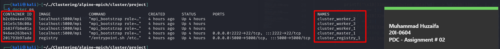
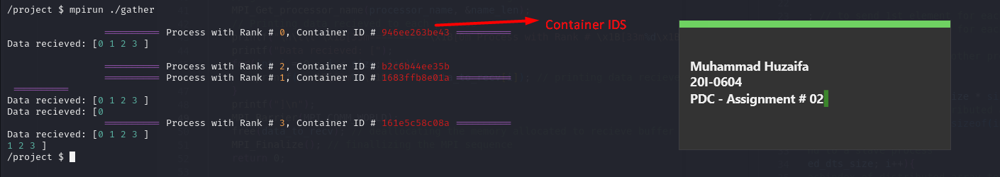
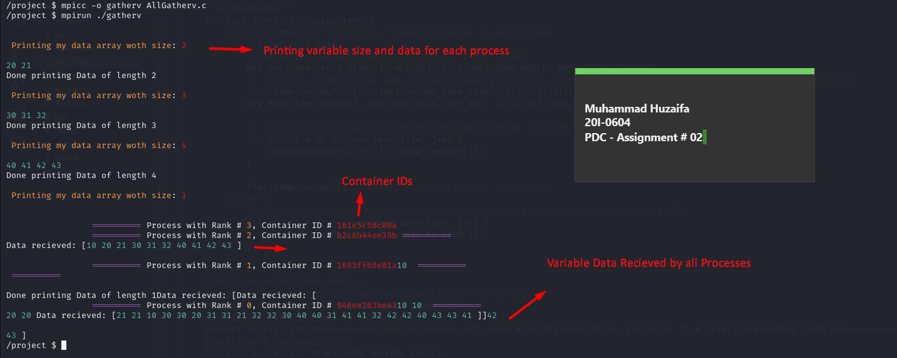
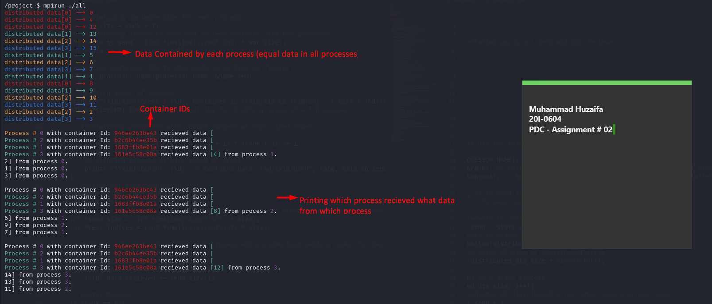
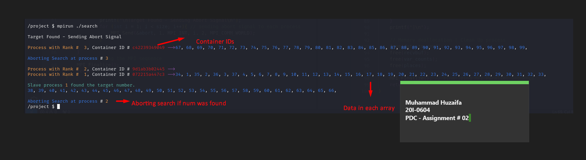

# MPI_Clustering
Implementation of Various MPI functions like AllGather, AllGatherv, AllTotal, AllTotalv etc using C.

# Cluster Setup 

Use the following commands to up your cluster for implementation of the tasks discussed below: Cd into the cluster folder after downloading and setting up your cluster environment from: 
```https://github.com/NLKNguyen/alpine-mpich ```

then traverse into the cluster directory using “cd alpine-mpich/cluster”. 

Before  beginning  the  docker  for  clustering  change  your  docker-compose.yml  as  shown  in  the  following screenshot to mount your project directory so you do not need to up and down docker every time you update something in your project folder. 

Then use the following command to up your cluster: 
```
- Sudo ./cluster.sh up size=<n> |  you can use any size you want

To down all containers use 
- sudo ./cluster.sh down size = <n> 

To run the cluster setup use following command 
- sudo ./cluster.sh login 
```

Now if you want to check that if your containers are up or not use the following command:  

```docker ps ```

Using this command, you will get something like this: 



Now that we have our cluster all set up lets get started with our tasks. 

### Task # 01: Using MPI\_Send & MPI\_Recv to implement Tasks

#### Part # 01: Implementing All Gather using MPI Send & receive Description: 

In this code we were supposed to use MPI send and receive to implement all gather MPI function. In short we needed to implement a function where every process in cluster could send its data to every other process and all nodes had all data of all processes. 

##### Output Screenshot 



As you can see above that all processes have shared their data among all other processes. 

#### Part # 02: Implementing All Gather V using MPI Send and Recive Description: 

This code was all same to the 1st code but instead of sending data of equal size from each process we needed to send data of variable size from each process and at the end all processes should had all data of all processes. 

##### Output Screenshot: 



Here in the screenshot you can see that all processes have different sizes and different data but all processes have managed to get the variable size data from all other processes. 

#### Part # 03: Implementing MPI All to All using MPI Send and Receive Description: 

We needed to implement All to All using MPI send and receive. This function basically distributes data in all processes in such a away that each process in the cluster ends up with the portion of data contributed by other processes in the cluster. For instance in array 1 had 1, 2, 3 and array 2 had 4, 5, 6 then proc 1 will have 1 & 4, proc 2 will have 2 & 5 and last proc will have 3 & 6 as shown in the screenshot below: 

##### Output screenshot: 



You can see in the screenshot above that each process in cluster have distributed assigned data like 0 has 0, 4, 8, 12 etc. and then its passes this data to other process like shown in lower part of the screenshot where it is shown that which processes has received what data from which process. 

#### Part # 04: Implementing All to All V using MPI Send and Receive Description: 

This is the same as the previous one only diff is that in this function we could send variable data to all other processes using data in distributed manner depending on variable size of data to send and the number of index to send the data from. 

##### Output screenshot: 


As you can see in the screen shot above process1 had 1 element which it sent to process 3 which had 4 elements and process 4 sent 2 elements to process 1 so now both processes have 3 element process 1 à20, 42 & 43 where it received 42 & 43 from process 3 and process 3 has 40, 41 and 20 where it recived 20 from process 01. Similar is the case for the 2 other processes. 

Task # 02 : Search & Abort 

Description 

In this task we were suppose to send distributed array to all processes such that if we had an array of 100 we senf 25 element array to 4 process in cluster and then these 4 process will search for an element in respective arrays. If found the element the process sends found signal to the master which on receival sends abort message/ signal to all the processes currently searching in their arrays and they all abort.  

##### Output Screenshot: 



As you can see in the screenshot above that each process finds element in its own array and when found its sends signal to master where master sent signal to all other processes and all other processes aborted search for that element. 
